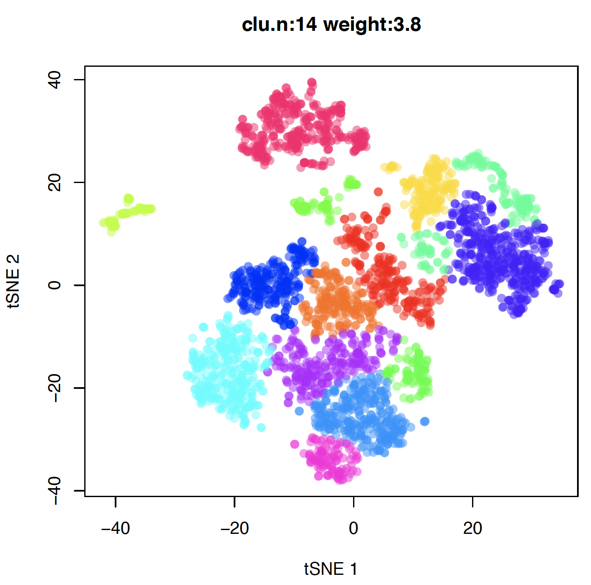
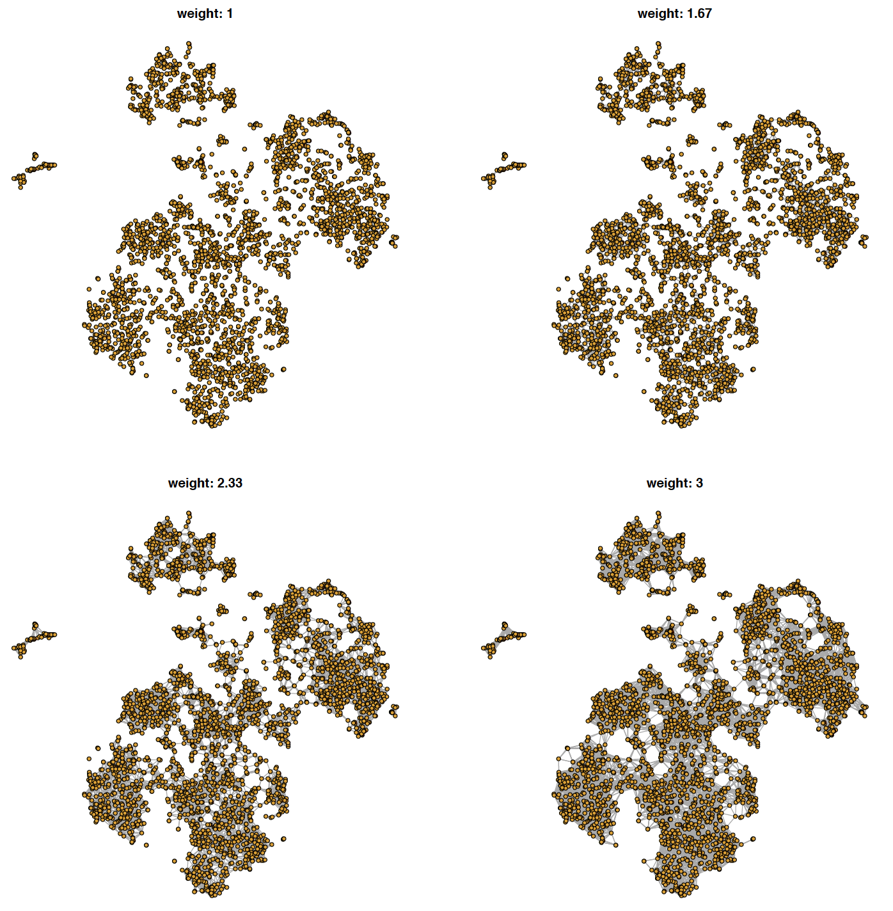
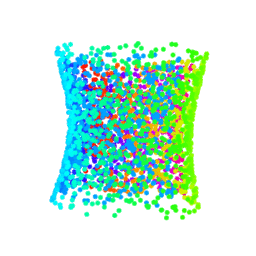
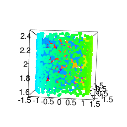
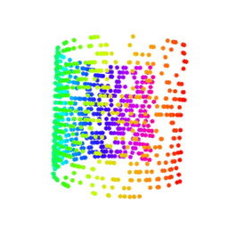
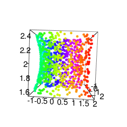
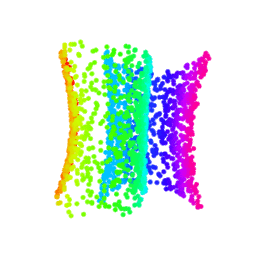

# GCluster: graphic based cluster
####
``` r
library(devtools)
install_github("Displayr/flipPlots")
``` 
 
# Examples:
### GCluster(dat=dat, wt=wt) and plot a graph removed edges by weights
  

[R codes](examples/01do_GCluster03.R) &nbsp;&nbsp;[R codes](examples/02do_GCluster03_1.R) 

### i2d: convert image to digital matrix (continue structure ...)
[code1](R/i2d.R)  [code2](R/i2d.R)   
 
